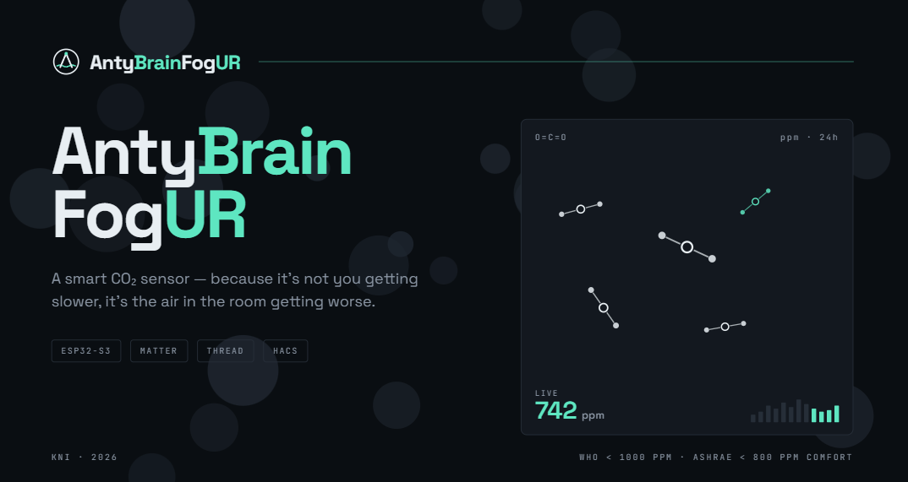

<p align="center">
  
</p>

# AntyBrainFogUR

Wbudowany system monitorowania środowiska i wspomagania funkcji poznawczych oparty na ESP32 — ESP32-S3 jako standalone device z ekranem, ESP32-C6 jako Thread border router, ESP32-H2 jako satelitarne węzły sieci.

[](#)

<br>

## Wspierane platformy i protokoły

<table align="center">
  <tr>
    <th>Mikrokontrolery</th>
    <th>Protokoły &amp; Ekosystemy</th>
  </tr>
  <tr>
    <td align="center">
      
      
      
    </td>
    <td align="center">
      
      
      
      
    </td>
  </tr>
</table>

<br>

**ESP32-S3** — standalone device z ekranem, interfejs użytkownika, główny punkt interakcji.  
**ESP32-C6** — Thread border router, łączy sieć Thread z Wi-Fi/Matter, główna platforma deweloperska.  
**ESP32-H2** — satelitarne węzły sieci Thread, zbieranie danych z sensorów, brak Wi-Fi.

<br>

## Wymagania

Wszystkie narzędzia muszą być zainstalowane **przed** pierwszym buildem.

<table>
  <tr>
    <th>Narzędzie</th>
    <th>Wersja</th>
    <th>Do czego</th>
  </tr>
  <tr>
    <td></td>
    <td><code>v5.x</code></td>
    <td>Cały firmware, narzędzia budowania, flash</td>
  </tr>
  <tr>
    <td></td>
    <td><code>≥ 3.16</code></td>
    <td>System budowania</td>
  </tr>
  <tr>
    <td></td>
    <td><code>≥ 3.8</code></td>
    <td>Skrypty IDF</td>
  </tr>
</table>

> **Środowisko budowania:** Matter SDK wymaga środowiska Linux. Na Windows konieczny jest **WSL2** (zalecany Ubuntu 22.04). Natywny build na Windows nie jest wspierany.

<br>

## Firmware

System składa się z trzech niezależnych projektów ESP-IDF, każdy pod inny chip i inną rolę w architekturze.

<table>
  <tr>
    <th>Projekt</th>
    <th>Chip</th>
    <th>Rola</th>
  </tr>
  <tr>
    <td><a href="firmware/matter-display/README.md"><strong>matter-display</strong></a></td>
    <td></td>
    <td>Standalone device z dotykowym ekranem LCD, interfejs użytkownika, bramka Matter</td>
  </tr>
  <tr>
    <td><a href="firmware/thread-router/README.md"><strong>thread-router</strong></a></td>
    <td></td>
    <td>Thread border router — most między siecią Thread a Wi-Fi/Matter</td>
  </tr>
  <tr>
    <td><a href="firmware/thread-satellite/README.md"><strong>thread-satellite</strong></a></td>
    <td></td>
    <td>Satelitarne węzły sieci Thread, akwizycja danych z sensorów</td>
  </tr>
</table>

Każdy projekt zawiera własny `README.md` z opisem płytki, rolą w systemie, wymaganiami i instrukcją buildu.

<br>

## Szybki start

Wymagane środowisko: **Linux** lub **WSL2** (Ubuntu 22.04+).

```bash
git clone https://github.com/kni-informatycy/AntyBrainFogur.git
cd AntyBrainFogur
```

Dalsze kroki zależą od tego, który węzeł chcesz zbudować:

- → **[matter-display](firmware/matter-display/README.md)** — ESP32-S3, ekran dotykowy, Matter
- → **[thread-router](firmware/thread-router/README.md)** — ESP32-C6, Thread border router
- → **[thread-satellite](firmware/thread-satellite/README.md)** — ESP32-H2, węzły sensorowe
