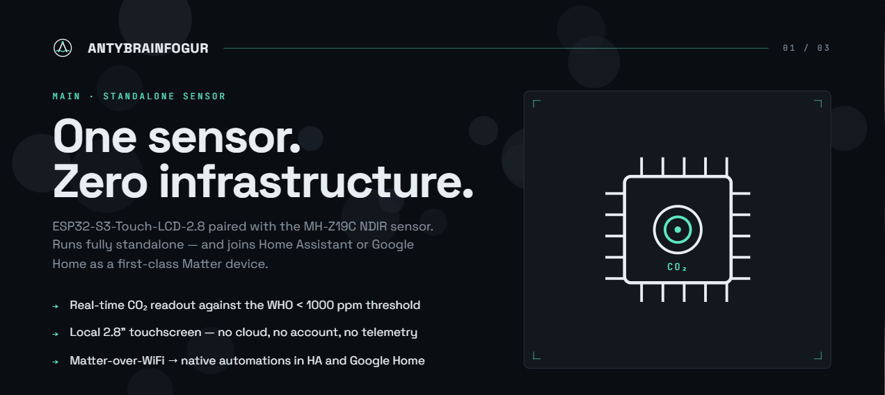

<p align="center">
  
</p>

# matter-display

Główny węzeł systemu AntyBrainFogur — standalone device z dotykowym ekranem LCD, interfejsem użytkownika i bramką Matter do ekosystemów smart home.

<br>

## Platforma

<table align="center">
  <tr>
    <th>Hardware</th>
    <th>Protokoły</th>
  </tr>
  <tr>
    <td align="center">
      
    </td>
    <td align="center">
      
      
      
    </td>
  </tr>
</table>

<br>

**Płytka:** Waveshare ESP32-S3-Touch-LCD-2.8 (`27690`)  
**Wyświetlacz:** IPS 2,8" 240×320, pojemnościowy panel dotykowy  
**MCU:** ESP32-S3, dual-core Xtensa LX7 @ 240 MHz, 512 KB SRAM + PSRAM  
**Rola w systemie:** punkt interakcji z użytkownikiem, wyświetlanie danych ze wszystkich węzłów, integracja z Google Home / Home Assistant przez Matter

<br>

## Wymagania

<table>
  <tr>
    <th>Narzędzie</th>
    <th>Wersja</th>
    <th>Do czego</th>
  </tr>
  <tr>
    <td></td>
    <td><code>v5.x</code></td>
    <td>Cały firmware, narzędzia budowania, flash</td>
  </tr>
  <tr>
    <td></td>
    <td><code>≥ 3.16</code></td>
    <td>System budowania</td>
  </tr>
  <tr>
    <td></td>
    <td><code>≥ 3.8</code></td>
    <td>Skrypty IDF</td>
  </tr>
</table>

> **Środowisko budowania:** wymagany **Linux** lub **WSL2** (Ubuntu 22.04+). Matter SDK nie wspiera natywnego buildu na Windows.

<br>

## Szybki start

```bash
# 1. Wejdź do katalogu projektu
cd firmware/matter-display

# 2. Załaduj środowisko IDF (raz na sesję terminala)
. $IDF_PATH/export.sh

# 3. Skonfiguruj target, zbuduj i wgraj
idf.py set-target esp32s3
idf.py build
idf.py -p /dev/ttyUSB0 flash monitor
```

Port `/dev/ttyUSB0` to standardowy port ESP32 na Linux. Sprawdź swój: `ls /dev/ttyUSB*`

<br>

## Struktura projektu

```
matter-display/
├── main/                   # Punkt wejścia aplikacji
│   ├── main.c
│   └── CMakeLists.txt
├── components/             # Komponenty lokalne (UI, sterownik LCD, Matter)
├── CMakeLists.txt
└── sdkconfig.defaults
```
