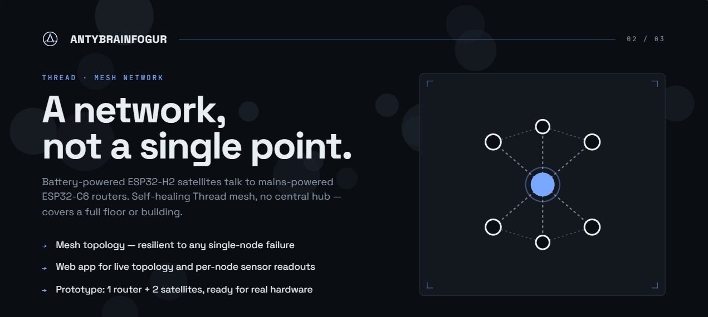

<p align="center">
  
</p>

# thread-satellite

Satellite nodes of the AntyBrainFogur Thread network — collect environmental sensor data and forward it to the border router over the Thread mesh.

<br>

## Platform

<table align="center">
  <tr>
    <th>Hardware</th>
    <th>Protocols</th>
  </tr>
  <tr>
    <td align="center">
      
    </td>
    <td align="center">
      
      
      
    </td>
  </tr>
</table>

<br>

**Board:** Waveshare ESP32-H2-Zero (`32261`)  
**MCU:** ESP32-H2, RISC-V single-core @ 96 MHz, IEEE 802.15.4 (Thread/Zigbee), BLE 5 — no Wi-Fi  
**Role in the system:** Thread end-device — environmental data acquisition (temperature, humidity, CO₂, air quality) and forwarding to the thread-router. Designed for low power consumption.

<br>

## Requirements

<table>
  <tr>
    <th>Tool</th>
    <th>Version</th>
    <th>Purpose</th>
  </tr>
  <tr>
    <td></td>
    <td><code>v5.x</code></td>
    <td>Full firmware stack, build tools, flash</td>
  </tr>
  <tr>
    <td></td>
    <td><code>≥ 3.16</code></td>
    <td>Build system</td>
  </tr>
  <tr>
    <td></td>
    <td><code>≥ 3.8</code></td>
    <td>IDF scripts</td>
  </tr>
</table>

> **Build environment:** Linux or **WSL2** (Ubuntu 22.04+) required. Matter SDK does not support native Windows builds.

<br>

## Quick Start

```bash
# 1. Enter the project directory
cd firmware/thread-satellite

# 2. Load the IDF environment (once per terminal session)
. $IDF_PATH/export.sh

# 3. Set target, build and flash
idf.py set-target esp32h2
idf.py build
idf.py -p /dev/ttyUSB0 flash monitor
```

`/dev/ttyUSB0` is the standard ESP32 port on Linux. Check yours: `ls /dev/ttyUSB*`

<br>

## Project structure

```
thread-satellite/
├── main/                   # Application entry point
│   ├── main.c
│   └── CMakeLists.txt
├── components/             # Local components (OpenThread, sensor drivers)
├── CMakeLists.txt
└── sdkconfig.defaults
```
